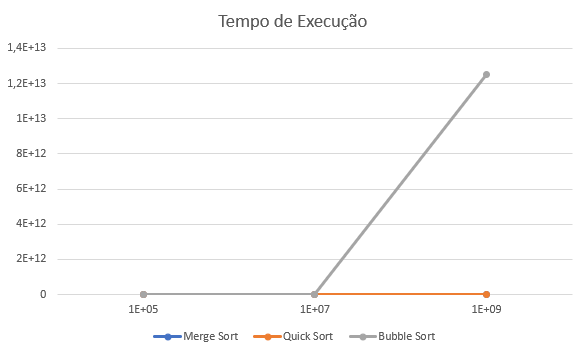
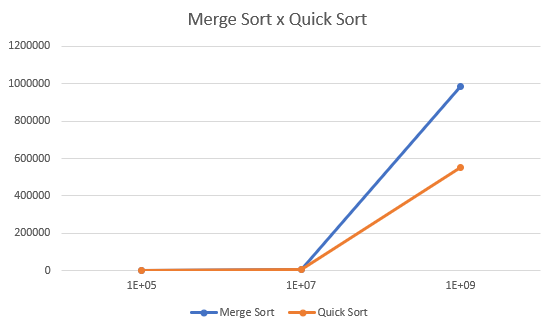

# Desafio Murano - Questão 1 - Algoritmos de Ordenação

Este é um projeto em C++ que realiza testes e medições de tempo de execução dos algoritmos de ordenação Bubble Sort, Merge Sort e Quick Sort em diferentes tamanhos de entrada. O objetivo é comparar o desempenho desses algoritmos para diferentes quantidades de dados. 

## Algoritmos de Ordenação

- **Merge Sort**: Algoritmo que divide o array em pedaços de N/2 recursivamente (~log N), ordena cada metade independentemente e ao fim mescla as duas metades de forma ordenada (~N). Para fazer a mescla das duas metades é necessário de um espaço adicional N. Complexidade Temporal: O(N*log N), Complexidade Espacial: O(N).

- **Quick Sort**: Algoritmo que reordena o array baseado em um elemento pivô, elementos menores que o pivô à esquerda e elementos maiores que o pivô à direita, divide em pedaços de N/2 e repita o processo recursivamente. Ao fim do processo, todos os elementos estarão na posição correta ao juntar os pedaços. Por cada recursão dividir os pedaços pela metade é necessário um espaço proporcional ao tamanho da árvore de recursão portanto, é necessário um espaço adicional de log N. Complexidade Temporal: O(N*log N), Complexidade Espacial: O(log N).

- **Bubble Sort**: Algoritmo que percorre o array N vezes para cada N (~N^2) e troca os valores adjacentes caso estejam na ordem errada. Não requere espaço adicional para fazer o ordenamento. Complexidade Temporal: O(N^2), Complexidade Especial: O(1).

| Algoritmo     | Complexidade Temporal | Complexidade Espacial |
|---------------|----------------------|-----------------------|
| Merge Sort    | O(N*log(N))          | O(N)                  |
| Quick Sort    | O(N*log(N)) (médio)  | O(log(N))             |
| Bubble Sort   | O(N^2)               | O(1)                  |

## Organização do Projeto

- `functions.h`: Arquivo de cabeçalho para a declaração das funções.
- `functions.cpp`: Arquivo com a implementação das funções.
- `benchmark.cpp`: Arquivo para efetuar o teste e a medição do tempo de execução dos algoritmos.
- `sort_times.csv`: Arquivo gerado com os tempos de execução dos algoritmos.

## Medição do Tempo de Execução

A proposta é que sejam avaliados os algoritmos para as quantidades: 10^5, 10^7, 10^9. Para o algoritmo Bubble Sort, apenas o tempo de execução para N = 10^5 é medido diretamente, pois o tempo de execução para N = 10^7 é muito longo. Já para os algoritmos Merge Sort e Quick Sort, o tempo de execução é medido para N = 10^5 e N = 10^7. No caso de N = 10^9, o tempo de execução para esses algoritmos é estimado, pois o uso de memória para armazenar 10^9 floats se mostrou impráticavel. Todas as estimativas tomaram como base a Complexidade Temporal de cada algoritmo.

## Execução da Implementação

## Resultados e Saída

Os tempos de execução dos algoritmos são registrados no arquivo `sort_times.csv`. A tabela está organizada no seguinte formato com os valores de tempo em milisegundos:

|     N     | Merge Sort | Quick Sort | Bubble Sort     |
|-----------|------------|------------|-----------------|
|    10^5   | 59         | 35         | 125404          |
|    10^7   | 7586       | 4243       | 1254040000      |
|    10^9   | 986180     | 551590     | 12540400000000  |

Ao analisar a tabela já é possível perceber a disparidade entre as ordens de grandeza dos algoritmos de Merge e Quick Sort em comparação com o algoritmo de Bubble Sort. Essa diferença já era esperada dado a Complexidade Temporal de cada algoritmo. Para facilitar a visualização utilizaremos dois gráficos gerados a partir do arquivo `sort_times.csv` por meio do programa Excel.

Inicialmente compararemos todos os algoritmos através do gráfico:

A curva do algoritmo de Bubble Sort, como esperado, mostra uma curva acentuada característica de uma complexidade quadrática de modo que, a inclinação da curva dos algoritmos de Merge e Quick Sort, que possuem características logarítmicas, se tornam imperceptíveis quando mostradas em um mesmo gráfico.

Um outro gráfico interessante é a comparação entre os algoritmos de Merge e Quick Sort para elementos gerados aleatoriamente:

É possível perceber que o algoritmo de Merge tem um desempenho pior em relação ao algoritmo Quick nesse cenário. Acredito que isso aconteça devido à minha implementação utilizar um vetor auxiliar para copiar o vetor mesclado ao vetor de números original em todos os processos de mesclagem, incrementando o tempo de execução.  
Um outro ponto a se destacar é que o algoritmo de Quick Sort possui a mesma Complexidade Temporal do algoritmo de Merge porém, possui Complexidade Espacial menor demonstrando superioridade em cenários como o desse desafio em que existem uma quantidade de elementos enorme. 

